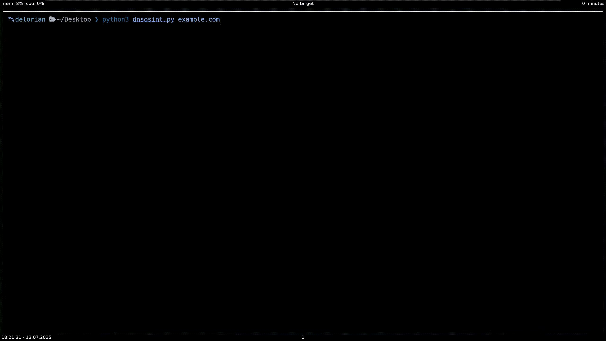

# 🛰️ DNSOSINT — Passive DNS Reconnaissance Tool

<p align="center">
  
</p>

**DNSOSINT** is a lightweight, single-file Python tool for passive reconnaissance on domains. It collects subdomains from public certificate transparency logs, resolves them, and enriches the results with reverse DNS and HTTP titles — all without requiring any external dependencies.

---

## 🔍 Features

- Fetch subdomains from `crt.sh`
- Resolve subdomains to IP addresses
- Get reverse DNS for each IP
- Grab HTTP titles (fast + silent)
- Query DNS records (MX, NS, TXT) via `dig`
- Display results in a clean, colorized, aligned table
- Show all discovered subdomains first
- CTRL+C interrupt support

---

## ⚙️ Requirements

- Python 3.x (tested on 3.13)
- Linux/Unix-based terminal
- `dig` command must be available (preinstalled on most systems)

> ✅ No pip modules required  
> ✅ No API keys or external configs

---

## 🧪 Usage

```bash
python3 dnsosint.py <domain>
```

Example:

```bash
python3 dnsosint.py ine.com
```

---

## 📌 Output

- Subdomains found (from crt.sh)
- Number of subdomains resolved
- Table with:
  - Subdomain
  - IP Address
  - Reverse DNS
  - HTTP Title
- DNS Records (MX, NS, TXT)

---

## ⚠️ Warnings

- 🧨 **CTRL+C doesn't always stop instantly.** If it hangs (especially during resolution), **spam `Ctrl+C` a few times.**
- 🌐 **If 0 subdomains are resolved**, just run the tool again. crt.sh can temporarily fail or block. It's normal.

---

## 👤 Author

**DelorianCS**  
[GitHub Profile](https://github.com/DelorianCS)  
Made for the cybersecurity community

---

## 📜 License

MIT License — use freely, credit appreciated
